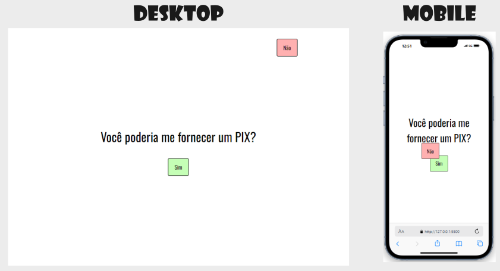

# Projeto Pedido Inegável (HTML, CSS e Javascript)

O projeto consiste em fazer fornecer uma pergunta com as opções de resposta SIM ou NÃO. Porém, quando se tentar marcar a opção NÃO, o botão muda de lugar toda vez que se passa o mouse em cima dele. Quando aberto em dispositivos Mobile, o botão NÃO fica mudando de lugar automaticamente.

## Design do projeto

